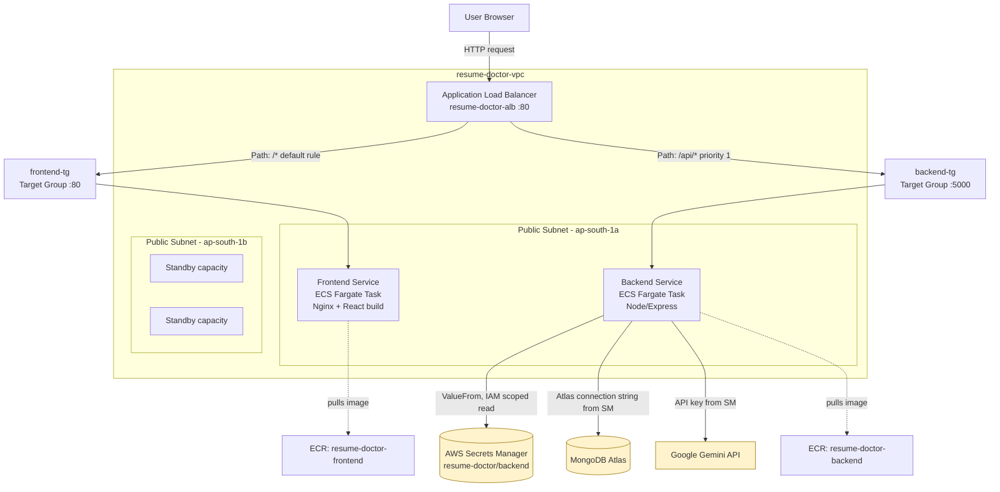

# Resume Doctor — AWS ECS Fargate Deployment Guide

This document describes the full production deployment workflow for **Resume Doctor**
(Node.js/Express backend + React/Nginx frontend) on **AWS ECS Fargate**, fronted by an
**Application Load Balancer (ALB)**, with secrets managed through **AWS Secrets Manager**.

> **Region:** `ap-south-1` (Mumbai)
> **Compute:** AWS Fargate (serverless containers, no EC2 management)
> **Registry:** Amazon ECR
> **Secrets:** AWS Secrets Manager (never stored in code, images, or env files pushed to git)

> **Note on redaction:** Values like `<ACCOUNT_ID>`, `<your-alb-dns-name>`, and IP
> addresses are intentionally replaced with placeholders throughout this document.
> Resource *names* (cluster, service, security group names, etc.) are kept as-is
> since they describe architecture, not secrets — but account IDs, live endpoints,
> and IPs are omitted so this document can be shared publicly (e.g. in a GitHub
> repo or portfolio) without exposing account-identifying infrastructure details.

---

## 1. Architecture Overview



**Request flow in one line:** Browser → ALB (port 80) → listener rule matches path →
forwards to the correct target group → target group routes to the healthy Fargate
task's private IP on the container port → container serves the response.

---

## 2. AWS Resource Inventory

| Resource | Name | Purpose |
|---|---|---|
| VPC | `resume-doctor-vpc` | Isolated network, 2 public subnets across 2 AZs, no NAT Gateway (cost saving) |
| ECR Repo | `resume-doctor-backend` | Stores backend Docker images (tagged `v1`, `v2`, `v3`…) |
| ECR Repo | `resume-doctor-frontend` | Stores frontend Docker images |
| Secrets Manager | `resume-doctor/backend` | Holds `MONGODB_URI`, `JWT_SECRET`, `HASH_ITERATIONS`, `GOOGLE_GENAI_API_KEY` |
| IAM Role | `ecsTaskExecutionRole` | Used by ECS to pull images from ECR and read the secret at container start |
| IAM Policy | `ResumeDoctorSecretsRead` | Scoped to `secretsmanager:GetSecretValue` on **only** `resume-doctor/backend-*` |
| ECS Cluster | `resume-doctor-cluster` | Fargate cluster hosting both services |
| ECS Task Def | `resume-doctor-backend` | Container spec: image, port 5000, env vars, secrets |
| ECS Task Def | `resume-doctor-frontend` | Container spec: image, port 80 |
| ECS Service | `resume-doctor-backend-service` | Keeps 1 backend task running, registered to `backend-tg` |
| ECS Service | `resume-doctor-frontend-service` | Keeps 1 frontend task running, registered to `frontend-tg` |
| Security Group | `resume-doctor-backend-sg` | Inbound 5000 from ALB SG only |
| Security Group | `resume-doctor-frontend-sg` | Inbound 80 from ALB SG only |
| Security Group | `resume-doctor-alb-sg` | Inbound 80 from `0.0.0.0/0` (public) |
| Target Group | `backend-tg` | Port 5000, health check `GET /health` |
| Target Group | `frontend-tg` | Port 80, health check `GET /` |
| Load Balancer | `resume-doctor-alb` | Internet-facing ALB, single HTTP:80 listener, 2 routing rules |

---

## 3. Prerequisites

- AWS account with an IAM user for CLI/local use (not root — see Section 8 on IAM hygiene)
- AWS CLI configured locally: `aws configure`
- Docker Desktop running
- MongoDB Atlas cluster already provisioned, with a database user and connection string
- A Google Gemini API key

---

## 4. Step-by-Step Deployment

### 4.1 Networking

1. Create VPC (`resume-doctor-vpc`) using "VPC and more" wizard:
   - 2 Availability Zones
   - 2 public subnets, 0 private subnets
   - No NAT Gateway
   - *(Trade-off: to keep costs at zero, tasks run in public subnets and are given
     public IPs purely so they can reach ECR/Secrets Manager outbound. Inbound access
     is still restricted to the ALB via security groups — see 4.5. A production
     system with a budget for a NAT Gateway should instead place tasks in private
     subnets with no public IP at all, for stronger isolation.)*

2. Create three security groups, all inside `resume-doctor-vpc`:
   - `resume-doctor-alb-sg` — inbound `HTTP:80` from `0.0.0.0/0`
   - `resume-doctor-backend-sg` — inbound `TCP:5000` from `resume-doctor-alb-sg` only
   - `resume-doctor-frontend-sg` — inbound `HTTP:80` from `resume-doctor-alb-sg` only

   > **Security note:** Neither backend nor frontend security groups allow direct
   > inbound traffic from the public internet. All public traffic must pass through
   > the ALB. This means the app containers are not directly reachable even if
   > someone discovers their IP.

### 4.2 Container Registry & Images

```bash
# Authenticate Docker to ECR (token valid ~12 hours, re-run when expired)
aws ecr get-login-password --region ap-south-1 | \
  docker login --username AWS --password-stdin \
  <ACCOUNT_ID>.dkr.ecr.ap-south-1.amazonaws.com

# Build & push backend
docker build --platform linux/amd64 -t resume-doctor-backend:vN ./Backend
docker tag resume-doctor-backend:vN <ACCOUNT_ID>.dkr.ecr.ap-south-1.amazonaws.com/resume-doctor-backend:vN
docker push <ACCOUNT_ID>.dkr.ecr.ap-south-1.amazonaws.com/resume-doctor-backend:vN

# Build & push frontend
docker build --platform linux/amd64 -t resume-doctor-frontend:vN ./Frontend
docker tag resume-doctor-frontend:vN <ACCOUNT_ID>.dkr.ecr.ap-south-1.amazonaws.com/resume-doctor-frontend:vN
docker push <ACCOUNT_ID>.dkr.ecr.ap-south-1.amazonaws.com/resume-doctor-frontend:vN
```

> Increment the `vN` tag on every deploy (`v1`, `v2`, `v3`…). Avoid relying on
> `:latest` in production task definitions — explicit version tags make rollbacks
> unambiguous.

### 4.3 Secrets

Store all sensitive configuration in **Secrets Manager**, never in the Dockerfile,
the image, or a `.env` file baked into the container:

- Secret name: `resume-doctor/backend`
- Type: "Other type of secret" → key/value pairs:
  - `MONGODB_URI`
  - `JWT_SECRET`
  - `HASH_ITERATIONS`
  - `GOOGLE_GENAI_API_KEY`
- Automatic rotation: left **disabled** (these are third-party credentials —
  MongoDB Atlas and Google AI — that AWS cannot rotate without a custom Lambda
  rotation function tailored to each provider's API)

IAM policy `ResumeDoctorSecretsRead`, attached to `ecsTaskExecutionRole`, scoped
narrowly:

```json
{
  "Version": "2012-10-17",
  "Statement": [
    {
      "Effect": "Allow",
      "Action": "secretsmanager:GetSecretValue",
      "Resource": "arn:aws:secretsmanager:ap-south-1:<ACCOUNT_ID>:secret:resume-doctor/backend-*"
    }
  ]
}
```

> **Why scoped like this:** the execution role can read *only* this one secret,
> not every secret in the account. If the role or a task were ever compromised,
> the blast radius is limited to this single credential set.

### 4.4 IAM Roles

- **`ecsTaskExecutionRole`** — used by ECS itself (not your app) to:
  - Pull images from ECR (`AmazonECSTaskExecutionRolePolicy`)
  - Read the secret at container startup (`ResumeDoctorSecretsRead`)
- **Task role** — left as `None`. The application code itself does not call any
  AWS APIs directly, so it doesn't need its own IAM identity. (If you later add
  features like S3 uploads, create a separate, narrowly-scoped task role rather
  than widening the execution role.)

### 4.5 ECS Cluster, Task Definitions, Services

1. Create cluster `resume-doctor-cluster` (Fargate).
2. Create task definition `resume-doctor-backend`:
   - Image: `...resume-doctor-backend:vN`
   - Port: 5000
   - Task execution role: `ecsTaskExecutionRole`
   - Task role: `None`
   - Env vars: `BACKEND_PORT=5000` (plain) + 4 secrets (`ValueFrom` → Secrets Manager)
3. Create task definition `resume-doctor-frontend`:
   - Image: `...resume-doctor-frontend:vN`
   - Port: 80
   - Task execution role: `ecsTaskExecutionRole`
4. Create the ALB (`resume-doctor-alb`, internet-facing, both public subnets,
   `resume-doctor-alb-sg`), with target groups `backend-tg` (port 5000,
   health check `/health`) and `frontend-tg` (port 80, health check `/`).
5. Add a listener rule on the ALB's `HTTP:80` listener:
   - Priority 1: path `/api/*` → forward to `backend-tg`
   - Default: everything else → forward to `frontend-tg`
6. Create ECS services `resume-doctor-backend-service` and
   `resume-doctor-frontend-service`, each attached to the ALB and its matching
   target group, desired count `1`, in both public subnets.

### 4.6 Application-side routing & CORS

The backend mounts all routes under `/api` so they match the ALB's path rule:

```javascript
app.use("/api/auth", authRouter);
app.use("/api/interview-prep", interviewRouter);
app.get("/api/health", (_req, res) => res.status(200).json({ status: "ok" }));
```

CORS is restricted to an explicit allow-list — **not** a wildcard `*` — so that
only the known frontend origins (local dev + the deployed ALB/domain) can call
the API with credentials:

```javascript
const allowedOrigins = [
  'http://localhost:5173',
  'http://<your-alb-dns-name>',       // e.g. resume-doctor-alb-XXXXXXXXX.ap-south-1.elb.amazonaws.com
  // 'https://<your-custom-domain>',  // add once a domain + ACM cert are set up (see Section 8)
];

app.use(cors({
  origin: (origin, callback) => {
    if (!origin || allowedOrigins.includes(origin)) callback(null, true);
    else callback(new Error('Not allowed by CORS'));
  },
  credentials: true,
}));
```

> **Why not `origin: '*'` with credentials:** allowing every origin to send
> authenticated (cookie-bearing) requests would let any website make
> credentialed calls to your API on a logged-in user's behalf. An explicit
> allow-list prevents that.
>
> **On the ALB DNS name itself:** it's an AWS-generated hostname, not a secret —
> anyone with it still can't do anything they couldn't already do by finding
> the IP through other means, since real access control happens at the security
> group, CORS, and application-auth layers, not by hiding the URL. It's still
> reasonable to swap it for a custom domain over HTTPS for a production launch.

### 4.7 MongoDB Atlas Network Access

Add `0.0.0.0/0` under Atlas **Network Access**, since your Fargate tasks don't
have fixed IPs without a NAT Gateway. Security still relies on the database
username/password (stored only in Secrets Manager) — Atlas access is not
"open," it's authenticated on every connection.

> If this project graduates to needing tighter network-level DB security, the
> correct fix is a NAT Gateway with a fixed Elastic IP, then allow-listing just
> that IP in Atlas instead of `0.0.0.0/0`.

---

## 5. Redeployment Workflow (for future updates)

Whenever you change backend or frontend code:

```bash
# 1. Rebuild with a new version tag
docker build --platform linux/amd64 -t resume-doctor-backend:vN+1 ./Backend

# 2. Re-authenticate to ECR if the token has expired (12h TTL)
aws ecr get-login-password --region ap-south-1 | docker login --username AWS \
  --password-stdin <ACCOUNT_ID>.dkr.ecr.ap-south-1.amazonaws.com

# 3. Tag and push
docker tag resume-doctor-backend:vN+1 <ACCOUNT_ID>.dkr.ecr.ap-south-1.amazonaws.com/resume-doctor-backend:vN+1
docker push <ACCOUNT_ID>.dkr.ecr.ap-south-1.amazonaws.com/resume-doctor-backend:vN+1
```

Then in the console:
1. **ECS → Task Definitions → resume-doctor-backend → Create new revision**
   → update only the Image URI to the new tag → keep all env vars/secrets → Create
2. **ECS → Services → resume-doctor-backend-service → Update service**
   → select the new revision → check **Force new deployment** → Update
3. Watch **Target Groups → backend-tg → Targets** until the new task shows
   `healthy`, then confirm the old task drains out
4. Smoke test: `curl http://<alb-dns-name>/api/health`

Repeat the same pattern for the frontend service when its code changes.

---

## 6. Verification Checklist After Any Deploy

- [ ] `curl http://<alb-dns-name>/` returns the frontend HTML
- [ ] `curl http://<alb-dns-name>/api/health` returns `{"status":"ok"}`
- [ ] `backend-tg` and `frontend-tg` both show **healthy** targets in EC2 → Target Groups
- [ ] ECS service **Deployment status** shows `Completed`, not `Failed`/`Rolled back`
- [ ] Browser DevTools console shows no CORS errors when using the live app
- [ ] No plaintext secrets appear in the task definition's plain **Value** fields
      (they must all show as **ValueFrom**, referencing Secrets Manager)

---

## 7. Troubleshooting Quick Reference

| Symptom | Likely cause | Fix |
|---|---|---|
| `ResourceInitializationError: unable to pull secrets or registry auth` | Task has no outbound internet path | Enable **Public IP** on the service (since there's no NAT Gateway) |
| Deployment circuit breaker triggered / rollback | Task failing ELB health checks | Check which target group the service is actually attached to; confirm health check path matches the container's real route |
| `Cannot GET /api/xyz` | ALB forwards full path as-is; app route doesn't include `/api` prefix | Mount routes under `/api` in Express, or change the ALB rule path to match |
| CORS error in browser console | Deployed origin not in the backend's allow-list | Add the ALB DNS name (or custom domain) to `allowedOrigins` |
| `curl` to task's public IP times out | Security group doesn't allow the source | Confirm inbound rule exists for the correct source (ALB SG, or `0.0.0.0/0` only for temporary direct testing) |
| ECR push returns `403 Forbidden` | ECR login token expired (12h TTL) | Re-run `aws ecr get-login-password | docker login ...` |

---

## 8. Security Notes — What This Setup Deliberately Avoids

To keep this deployment from being unnecessarily exposed:

- **No secrets in the image or git repo.** All credentials live in Secrets
  Manager and are injected at container start via `ValueFrom`, never baked
  into a Docker layer or committed to version control.
- **No wildcard IAM permissions.** The execution role's Secrets Manager access
  is scoped to one secret ARN pattern, not `"Resource": "*"`.
- **No direct public inbound to application containers.** Both `backend-sg`
  and `frontend-sg` only accept traffic from the ALB's security group —
  the containers are not reachable by IP from the open internet, only through
  the ALB.
- **No wildcard CORS with credentials.** Only known, explicit origins can make
  authenticated requests.
- **Temporary debugging rules should be removed.** During initial setup, a
  `0.0.0.0/0` inbound rule was added to `backend-sg` on port 5000 for direct
  `curl` testing. **This should be deleted now that the ALB path is confirmed
  working** — leaving it in place would allow anyone on the internet to hit
  the backend directly, bypassing the ALB and its routing/CORS boundary.
- **No committed `.env` files.** Local `.env` files used for development
  should be in `.gitignore` and never pushed to the image — only the 5
  environment variables the container needs are injected by ECS at runtime.

### Recommended next hardening steps (optional, not yet done)
- Add an HTTPS listener (ACM certificate) instead of plain HTTP
- Move tasks into private subnets behind a NAT Gateway once budget allows
- Restrict MongoDB Atlas Network Access to a fixed IP (via NAT Gateway) instead of `0.0.0.0/0`
- Enable CloudWatch Container Insights for better observability
- Turn on ECS deployment alarms for automatic rollback on repeated task failures

---
# Note
*Document reference for the Resume Doctor deployment on AWS ECS Fargate, region `ap-south-1`.*
