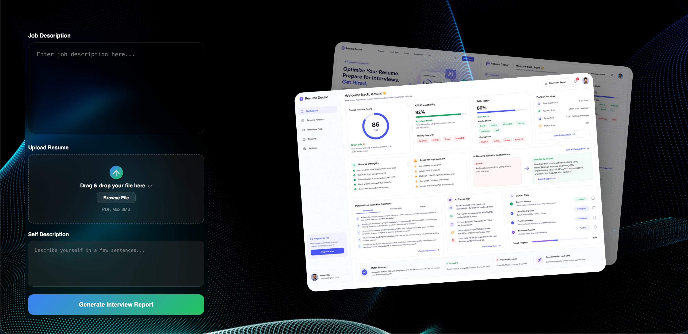
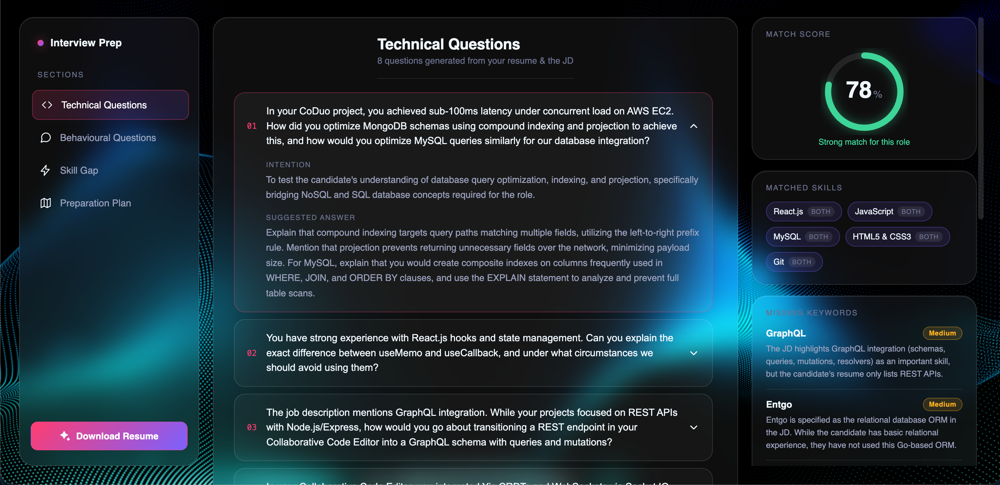
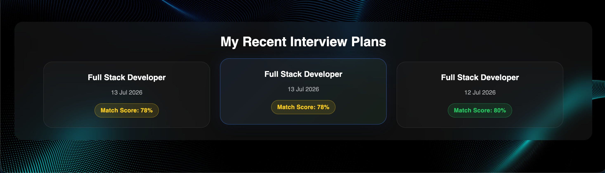
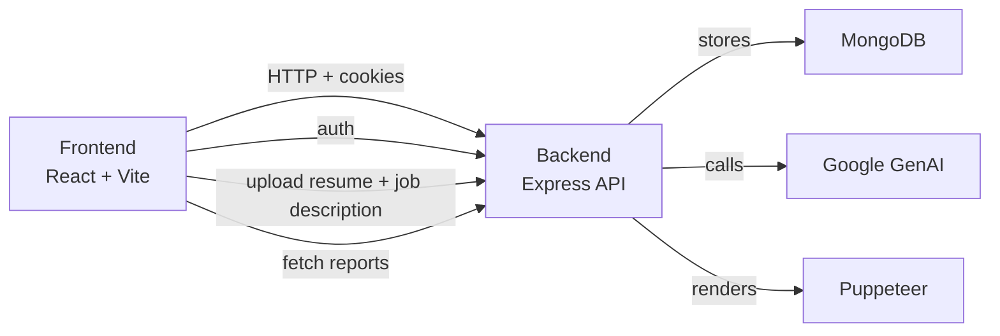

# Resume Doctor

[](https://github.com)
[](LICENSE)
[](https://nodejs.org/)
[](https://react.dev)

## Overview
Resume Doctor is a polished resume analysis and interview preparation application. It helps users:

- upload a resume PDF,
- compare that resume to a target job description,
- generate a tailored AI-powered interview report,
- save report history,
- and create a downloadable PDF resume.

The workspace is split into two complementary applications:

- `Backend/`: Node.js + Express API server with authentication, file upload, MongoDB storage, and AI-powered report generation.
- `Frontend/`: React + Vite client application with auth, upload forms, report viewing, and interactive navigation.

> This README was created to describe the complete full-stack architecture, the backend flow, frontend flow, and how both sides communicate.

---

## Table of Contents

1. [Features](#features)
2. [Tech Stack](#tech-stack)
3. [Screenshots](#screenshots)
4. [Architecture Summary](#architecture-summary)
5. [Backend Flow](#backend-flow)
6. [Frontend Flow](#frontend-flow)
7. [API Endpoint Summary](#api-endpoint-summary)
8. [Environment & Setup](#environment--setup)
9. [Future Improvements](#future-improvements)
10. [Author](#author)
11. [License](#license)

---

## Features

- User registration, login, and session-based authentication
- JWT cookie management with token blacklist support
- Secure resume PDF upload with `multer`
- Resume parsing using `pdf-parse`
- AI-generated interview preparation reports via Google GenAI
- Saved report history for each user
- PDF resume generation from AI-designed HTML content
- Protected frontend routes for upload and report viewing
- Clear separation of backend and frontend responsibilities

---

## Tech Stack

- Frontend: React 19, Vite, Sass, React Router, Axios
- Backend: Node.js, Express, MongoDB, Mongoose, JWT, bcryptjs, cookie-parser, CORS
- AI & PDF: Google GenAI, Zod validation, Puppeteer
- Authentication: cookie-based JWT with blacklist logout

---

## Screenshots

### Landing / Upload Demo



### Interview Report Preview



### Recent Interview Plans



---

## Architecture Summary

Resume Doctor is designed as a client/server application with clear separation between UI and API.

- The frontend handles user interactions, authentication state, file upload, and report display.
- The backend handles authentication, file parsing, AI orchestration, report persistence, and PDF generation.
- MongoDB stores users and generated interview report documents.
- Google GenAI produces structured JSON outputs and HTML-based resume content.

### Architecture Diagram



---

## Backend Flow

### Backend Directory Structure

```
Backend/
  .env
  package.json
  server.js
  src/
    app.js
    config/
      database.js
    controllers/
      auth.controller.js
      interview.controller.js
    middlewares/
      auth.middleware.js
      file.middleware.js
    models/
      blacklist.model.js
      interviewReport.model.js
      user.model.js
    routes/
      auth.route.js
      interview.routes.js
    services/
      ai.service.js
```

### Key Backend Components

#### `server.js`
- Loads environment variables.
- Connects to MongoDB using `src/config/database.js`.
- Starts the Express server on `process.env.BACKEND_PORT`.

#### `src/app.js`
- Configures middleware for JSON parsing, cookies, and CORS.
- Mounts routes for authentication and interview prep.
- Enables cross-origin authentication with credentials from the React frontend.

#### Authentication
- `src/routes/auth.route.js`: Defines auth endpoints.
- `src/controllers/auth.controller.js`: Implements registration, login, logout, and `get-me` endpoints.
- `src/models/user.model.js`: Mongoose schema for users.
- `src/middlewares/auth.middleware.js`: Verifies JWT tokens from cookies and rejects blacklisted tokens.
- `src/models/blacklist.model.js`: Stores invalidated tokens after logout.

#### Interview Report Flow
- `src/routes/interview.routes.js`: Defines protected interview endpoints.
- `src/controllers/interview.controller.js`: Handles resume upload parsing, AI report generation, report retrieval, and resume PDF generation.
- `src/models/interviewReport.model.js`: Stores generated report data and metadata in MongoDB.
- `src/services/ai.service.js`: Uses Google GenAI to produce JSON interview reports and HTML resumes, then converts HTML to PDF with Puppeteer.

#### File Upload
- `src/middlewares/file.middleware.js`: Uses `multer.memoryStorage()` to accept resume uploads in memory.
- Upload limit is configured at 3 MB.

### Backend Flow Diagram

1. Client authenticates with `/api/auth/login` or `/api/auth/register`.
2. Backend creates and signs a JWT token.
3. Backend returns the JWT token in an HTTP-only cookie.
4. Client sends authenticated requests with credentials.
5. Protected routes use `auth.middleware.authUser` to validate the JWT and check token blacklist.
6. Resume upload requests go through `multer` and are parsed using `pdf-parse`.
7. Parsed resume text, job description, and self-description are passed to `ai.service`.
8. `ai.service` calls Google GenAI to generate structured JSON report data.
9. Report is saved into MongoDB using `interviewReport.model.js`.
10. On request, backend returns saved reports or generates PDF resumes using Puppeteer.

---

## Frontend Flow

### Frontend Directory Structure

```
Frontend/
  package.json
  vite.config.js
  index.html
  src/
    App.jsx
    app.routes.jsx
    main.jsx
    style.scss
    assets/
    demo/
    features/
      auth/
        auth.context.jsx
        hooks/useAuth.js
        pages/
          Home.jsx
          Login.jsx
          Register.jsx
        services/auth.api.js
      interview/
        interview.context.jsx
        hooks/useInterview.js
        pages/
          Interview.jsx
          InterviewSkeleton.jsx
          Upload.jsx
        services/interview.api.js
      legal/
    layout/
      Footer.jsx
      MainLayout.jsx
    styles/
      button.scss
```

### Key Frontend Components

#### `src/App.jsx`
- Wraps the application in `AuthProvider` and `InterviewProvider`.
- Sets video background and overlay.
- Renders routes via `RouterProvider`.

#### `src/app.routes.jsx`
- Defines pages and protected routes.
- `/upload` and `/interview/:interviewId` require authentication.
- Other landing, demo, and legal pages are public.

#### Auth Context and Hooks
- `src/features/auth/auth.context.jsx`: Provides user, loading, and auth state.
- `src/features/auth/hooks/useAuth.js`: Handles login, registration, logout, and current user retrieval.
- `src/features/auth/services/auth.api.js`: Sends auth requests to the backend using Axios.

#### Interview Services
- `src/features/interview/services/interview.api.js`: Sends interview analysis requests and fetches reports.
- Generates `FormData` with `resume`, `jobDescription`, and `selfDescription`.
- Requests are sent to protected backend endpoints with credentials.

#### Interview Context
- `src/features/interview/interview.context.jsx`: Stores current report and list of saved reports.

#### Upload & Report Pages
- `Upload.jsx`: Provides resume upload UI and form fields for job description and self-description.
- `Interview.jsx`: Displays generated interview report details.
- `InterviewSkeleton.jsx`: Likely shown while data is loading or when a report is not ready.

### Frontend Flow Diagram

1. User visits the frontend at `http://localhost:5173`.
2. User can register or login via auth forms.
3. After authentication, the frontend obtains user details using `/api/auth/get-me`.
4. Authenticated user navigates to `/upload`.
5. User selects a resume file and enters job description and self-description.
6. Frontend sends the file and text to `/api/interview-prep/ai-resume-checker`.
7. The backend processes the request, generates the AI report, and returns saved interview report data.
8. Frontend stores the returned report in context and navigates to the report view.
9. User can view saved interview reports and request resume PDF generation.

---

## API Endpoint Summary

| Endpoint | Method | Auth Required | Purpose |
|---|---|---|---|
| `/api/auth/register` | POST | No | Register a new user |
| `/api/auth/login` | POST | No | Login and create session cookie |
| `/api/auth/logout` | GET | Yes | Logout and blacklist token |
| `/api/auth/get-me` | GET | Yes | Fetch current user info |
| `/api/interview-prep/ai-resume-checker` | POST | Yes | Upload resume + JD + self description to generate report |
| `/api/interview-prep/` | GET | Yes | List all saved reports for user |
| `/api/interview-prep/report/:interviewId` | GET | Yes | Get one saved report detail |
| `/api/interview-prep/resume/pdf/:interviewReportId` | POST | Yes | Generate downloadable resume PDF |

---

## Environment & Setup

### Backend Setup

1. Navigate to the backend folder:
   ```bash
   cd Backend
   ```
2. Install dependencies:
   ```bash
   npm install
   ```
3. Create `.env` with required values:
   - `MONGODB_URI`
   - `JWT_SECRET`
   - `HASH_ITERATIONS`
   - `BACKEND_PORT`
   - `GOOGLE_GENAI_API_KEY`
4. Run the backend:
   ```bash
   npm run dev
   ```

### Frontend Setup

1. Navigate to the frontend folder:
   ```bash
   cd Frontend
   ```
2. Install dependencies:
   ```bash
   npm install
   ```
3. Run the frontend:
   ```bash
   npm run dev
   ```

### Default Local URLs

- Frontend: `http://localhost:5173`
- Backend: `http://localhost:3000`

---

## Future Improvements

- Add proper CI/CD badge and automated tests.
- Add a LICENSE file to clarify open-source usage.
- Implement refresh token support for longer login sessions.
- Add frontend state for report history filtering and pagination.
- Add better error handling and user notifications for backend failures.
- Add a real UI dashboard for report analytics and match trends.
- Add multi-file resume uploads and resume version history.

---

## Author

- Aman Raj
- Project creator and proof of concept implementer

---

## License

- No license is specified for this repository.
- Add a `LICENSE` file if you want to publish this as open source.

---

## Image Notes

The repo includes demo screenshots used in this README:

- `Frontend/src/demo/screenshots/dashboard-and-upload.png`
- `Frontend/src/demo/screenshots/interview-prep-questions.png`
- `Frontend/src/demo/screenshots/recent-interview-plans.png`


1. Navigate to the frontend folder:
   ```bash
   cd Frontend
   ```
2. Install dependencies:
   ```bash
   npm install
   ```
3. Run the frontend app:
   ```bash
   npm run dev
   ```

### Base URLs

- Frontend: `http://localhost:5173`
- Backend: `http://localhost:3000`

---

## Important Notes

- The backend uses cookie-based JWT auth and stores token state in `Backend/src/models/blacklist.model.js`.
- Resume uploads are accepted as multipart/form-data with the field name `resume`.
- AI generation is handled by Google GenAI, and output is validated with Zod schemas.
- The frontend is designed for React 19 and Vite.
- This README does not modify any existing code.

---

## Image References

The repository includes image assets in the frontend folder that may be useful for documentation or demo pages:

- `Frontend/public/logo.png`
- `Frontend/src/demo/screenshots/recent-interview-plans.png`
- `Frontend/src/demo/screenshots/dashboard-and-upload.png`
- `Frontend/src/demo/screenshots/interview-prep-questions.png`
- `Frontend/assets/creative-image.svg`
- `Frontend/assets/resume.png`
- `Frontend/assets/profile.jpeg`
- `Frontend/assets/resume2.png`

> If you want to use images in a published README, reference these by relative path from the root README file or copy them to a shared documentation folder.
